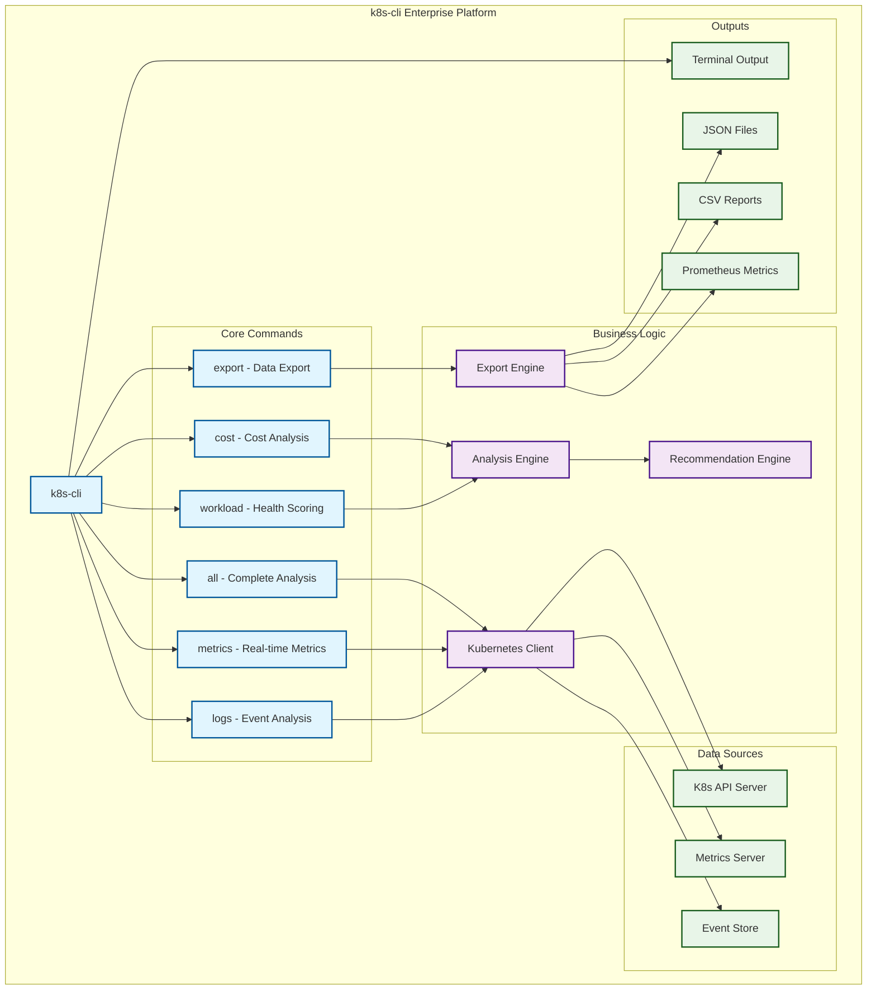
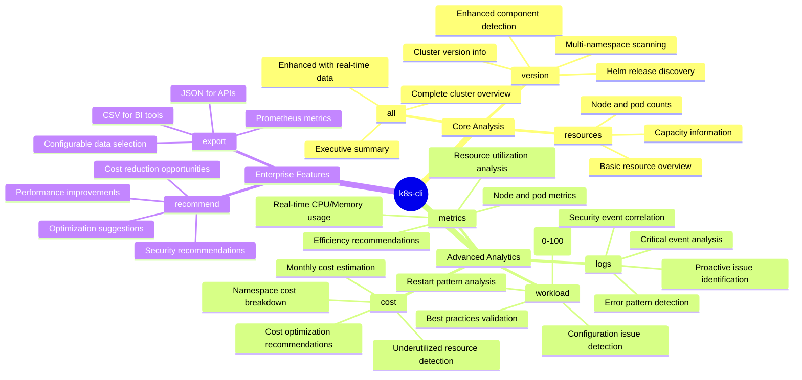

# 🚀 k8s-cli - Enterprise Kubernetes Analysis Platform

[](https://golang.org/)
[](LICENSE)
[](VERSION)
[](DOCUMENTATION_INDEX.md)

> **Comprehensive Kubernetes cluster analysis, cost optimization, and monitoring platform**

---

## 🎯 Overview

k8s-cli has evolved from a basic information tool to a **comprehensive enterprise-grade platform** that provides real-time insights, cost optimization, workload health analysis, and proactive monitoring for Kubernetes clusters.

### 🌟 Key Value Propositions

- **💰 Cost Optimization** - Identify underutilized resources and potential savings
- **📊 Real-time Insights** - CPU/Memory metrics with actionable recommendations
- **🔍 Proactive Monitoring** - Health scoring and issue detection
- **📤 Enterprise Integration** - Multi-format exports (JSON/CSV/Prometheus)
- **🎯 Business Intelligence** - Data-driven decision making for DevOps, FinOps, and SRE teams

---

## 🏗️ Architecture Overview



---

## 📊 Command Structure & Capabilities



---

## 🚀 Quick Start

### Prerequisites
- **Kubernetes cluster** (local or remote)
- **kubectl** configured
- **Go 1.24.5+** (for development)
- **metrics-server** installed (for real-time metrics)

### Installation

#### Option 1: Download Binary (Recommended)
```bash
# Download latest release
curl -LO https://github.com/your-org/k8s-cli/releases/latest/download/k8s-cli-linux-amd64
chmod +x k8s-cli-linux-amd64
sudo mv k8s-cli-linux-amd64 /usr/local/bin/k8s-cli
```

#### Option 2: Build from Source
```bash
# Clone repository
git clone https://github.com/your-org/k8s-cli.git
cd k8s-cli

# Build
make build

# Install
sudo cp bin/k8s-cli /usr/local/bin/
```

#### Option 3: Development Setup
```bash
# Complete development environment
./scripts/dev-setup.sh

# Start development with hot reload
make -f Makefile.dev watch
```

### First Run
```bash
# Complete cluster analysis
k8s-cli all

# Real-time metrics
k8s-cli metrics --nodes --pods --utilization

# Cost analysis
k8s-cli cost --underutilized

# Export data
k8s-cli export --format json --costs --metrics
```

---

## 💼 Enterprise Use Cases

### 🏦 FinOps (Financial Operations)
```bash
# Daily cost optimization
k8s-cli cost --underutilized > daily-savings-$(date +%Y%m%d).txt

# Weekly finance report
k8s-cli export --format csv --costs --output ./finance-reports/

# Cost optimization automation
k8s-cli cost --optimizations | grep "High Priority"
```

### 🔧 DevOps Monitoring
```bash
# Real-time cluster dashboard
k8s-cli metrics --nodes --pods --utilization

# Health monitoring pipeline
k8s-cli workload --unhealthy-only | tee /dev/stderr | wc -l

# Prometheus integration
k8s-cli export --format prometheus --output /var/lib/prometheus/
```

### 🚨 SRE (Site Reliability Engineering)
```bash
# Incident response
k8s-cli logs --critical --patterns --hours 2

# Post-incident analysis
k8s-cli export --format json --logs --events --hours 24

# Proactive monitoring
k8s-cli workload --deployments --unhealthy-only
```

### 📊 Business Intelligence
```bash
# Executive dashboard data
k8s-cli export --format csv --costs --metrics --filename executive-$(date +%Y%m%d)

# Trend analysis
k8s-cli all > cluster-health-$(date +%Y%m%d-%H%M).txt

# Compliance reporting
k8s-cli export --format json --logs --events --namespace production
```

---

## 🎯 Command Reference

### Core Commands

#### `k8s-cli all`
**Complete cluster analysis with enterprise insights**
```bash
k8s-cli all                    # Comprehensive analysis
k8s-cli all --kubeconfig ./config  # Custom kubeconfig
```
**Includes:** Cluster info, real-time metrics, cost overview, workload health, critical events

#### `k8s-cli version`
**Cluster version and enhanced component discovery**
```bash
k8s-cli version               # Comprehensive component analysis
                              # - Kubernetes cluster version
                              # - All components across all namespaces  
                              # - Helm releases with version info
                              # - Source identification (Helm/K8s)
                              
k8s-cli --version             # CLI tool version info
k8s-cli -v                    # CLI version (short form)
```

**New in v2.0.1:**
- 🎯 **Helm Integration**: Automatically detects Helm releases
- 🔍 **All-Namespace Scanning**: Finds components in any namespace
- 📊 **Source Column**: Shows installation method (Helm/Deployment/StatefulSet/DaemonSet)
- 🚀 **25+ Components**: Expanded recognition library
- ⚡ **Smart Deduplication**: Prioritizes Helm information when available

#### `k8s-cli resources`
**Basic resource overview**
```bash
k8s-cli resources             # Cluster resources
k8s-cli resources --namespace prod # Specific namespace
```

### Advanced Analytics

#### `k8s-cli metrics`
**Real-time cluster metrics and utilization analysis**
```bash
k8s-cli metrics --nodes                    # Node metrics only
k8s-cli metrics --pods --namespace prod    # Pod metrics for namespace
k8s-cli metrics --utilization              # Utilization analysis
k8s-cli metrics --nodes --pods --utilization # Complete metrics
```

**Key Features:**
- Real-time CPU/Memory usage (not just capacity)
- Resource utilization analysis with efficiency scoring
- Rightsizing recommendations based on actual usage
- Performance bottleneck identification

#### `k8s-cli cost`
**Cost analysis and optimization recommendations**
```bash
k8s-cli cost                              # Complete cost analysis
k8s-cli cost --nodes                      # Node cost breakdown
k8s-cli cost --namespaces                 # Namespace costs
k8s-cli cost --underutilized              # Underutilized resources
k8s-cli cost --optimizations              # Cost optimization tips
```

**Key Features:**
- Monthly cost estimation by node type
- Namespace cost breakdown and per-pod costs
- Underutilized resource detection with savings potential
- ROI analysis for optimization recommendations

#### `k8s-cli workload`
**Workload health analysis and scoring**
```bash
k8s-cli workload                          # All workloads
k8s-cli workload --unhealthy-only         # Problem workloads only
k8s-cli workload --deployments            # Deployments only
k8s-cli workload --pods --namespace prod  # Detailed pod analysis
```

**Key Features:**
- Health scoring (0-100) for all workload types
- Configuration issue detection and best practices
- Restart pattern analysis and failure prediction
- Automated recommendations for improvements

#### `k8s-cli logs`
**Event analysis and proactive monitoring**
```bash
k8s-cli logs --critical                   # Critical events only
k8s-cli logs --patterns --hours 24        # Error patterns last 24h
k8s-cli logs --security-events            # Security-related events
k8s-cli logs --pod-analysis --namespace prod # Pod-level analysis
```

**Key Features:**
- Critical event detection and categorization
- Error pattern analysis with frequency tracking
- Security event correlation and risk assessment
- Predictive issue identification

### Enterprise Integration

#### `k8s-cli export`
**Multi-format data export for enterprise tools**
```bash
k8s-cli export --format json              # JSON for APIs
k8s-cli export --format csv               # CSV for spreadsheets
k8s-cli export --format prometheus        # Prometheus metrics
k8s-cli export --costs --metrics --logs   # Selective data export
k8s-cli export --output ./reports/ --filename weekly-$(date +%Y%U)
```

**Supported Formats:**
- **JSON** - API integration, automation, custom tools
- **CSV** - Excel, BI tools, financial analysis
- **Prometheus** - Monitoring systems, Grafana dashboards

#### `k8s-cli recommend`
**Optimization and best practice recommendations**
```bash
k8s-cli recommend                         # All recommendations
k8s-cli recommend --severity High         # High priority only
k8s-cli recommend --type Security         # Security recommendations
```

---

## 📈 Performance & Scalability

### Cluster Support
- ✅ **Small clusters** (1-10 nodes) - Sub-second analysis
- ✅ **Medium clusters** (10-100 nodes) - <10 seconds analysis
- ✅ **Large clusters** (100-1000+ nodes) - <30 seconds analysis
- ✅ **Multi-namespace** environments with filtering

### Resource Usage
- **Memory:** <100MB typical usage
- **CPU:** Minimal impact on cluster
- **Network:** Efficient API usage with pagination
- **Storage:** Configurable export retention

### Performance Optimizations
- Concurrent data fetching for faster analysis
- Intelligent caching for repeated operations
- Streaming large datasets to minimize memory
- Efficient API calls with proper pagination

---

## 🛠️ Development & Customization

### Development Environment
```bash
# Complete development setup
./scripts/dev-setup.sh

# Start hot reload development
make -f Makefile.dev watch

# Run quality checks
make -f Makefile.dev check-all
```

### Available Make Targets
```bash
# Development
make -f Makefile.dev build          # Build binary
make -f Makefile.dev test           # Run tests
make -f Makefile.dev watch          # Auto-rebuild
make -f Makefile.dev dev-cycle      # Format, test, build

# Quality
make -f Makefile.dev lint           # Run linter
make -f Makefile.dev security-scan  # Security check
make -f Makefile.dev check-all      # All quality checks

# Documentation
make -f Makefile.dev docs-update    # Update docs
make -f Makefile.dev docs-serve     # Serve docs locally

# Release
make -f Makefile.dev release-build  # Multi-platform build
```

### VS Code Integration
The project includes complete VS Code configuration:
- **Build tasks** for all operations
- **Debug configurations** for all commands
- **Auto-formatting** and linting
- **Integrated testing** and coverage

---

## 📚 Documentation

### Complete Documentation Suite
- **[Architecture Guide](docs/ARCHITECTURE.md)** - System design and components
- **[API Documentation](docs/API.md)** - Internal API reference
- **[Development Guide](docs/DEVELOPMENT.md)** - Contributing and workflows
- **[Usage Examples](docs/EXAMPLES.md)** - Comprehensive command examples
- **[Documentation Index](DOCUMENTATION_INDEX.md)** - Master documentation index

### Quick References
- **[Command Examples](docs/EXAMPLES.md)** - Copy-paste ready examples
- **[Troubleshooting](docs/EXAMPLES.md#troubleshooting-common-issues)** - Common issues and solutions
- **[Configuration](docs/EXAMPLES.md#configuration-examples)** - Custom configuration options

---

## 🔧 Configuration

### Environment Variables
```bash
export K8S_CLI_NAMESPACE=production      # Default namespace
export K8S_CLI_OUTPUT_FORMAT=json        # Default output format
export K8S_CLI_KUBECONFIG=/path/to/config # Custom kubeconfig
export K8S_CLI_DEBUG=true                # Enable debug mode
```

### Configuration File
```yaml
# ~/.k8s-cli.yaml
output:
  format: table
  colors: true
  
metrics:
  cache_duration: 5m
  include_system_pods: false
  
cost:
  currency: USD
  default_node_cost: 72.0
  
export:
  default_format: json
  default_output: ./exports
```

---

## 📊 Feature Comparison

| Feature | v1.x (Basic) | v2.0 (Enterprise) |
|---------|-------------|-------------------|
| **Cluster Info** | ✅ Static info | ✅ Enhanced with real-time data |
| **Resource Overview** | ✅ Basic counts | ✅ With utilization analysis |
| **Recommendations** | ✅ Basic suggestions | ✅ Advanced optimization engine |
| **Real-time Metrics** | ❌ | ✅ CPU/Memory with efficiency scoring |
| **Cost Analysis** | ❌ | ✅ Complete cost optimization platform |
| **Workload Health** | ❌ | ✅ Health scoring and issue detection |
| **Event Analysis** | ❌ | ✅ Proactive monitoring and patterns |
| **Data Export** | ❌ | ✅ JSON/CSV/Prometheus integration |
| **Enterprise Features** | ❌ | ✅ FinOps, DevOps, SRE workflows |
| **Documentation** | ⚠️ Basic | ✅ Comprehensive with examples |
| **Development Tools** | ⚠️ Basic | ✅ Advanced workflows and automation |

---

## 🚀 Roadmap

### v2.1 (Q2 2024)
- 🔒 **Security analysis** with vulnerability scanning
- 🌐 **Multi-cluster** support and federation
- 🤖 **Machine learning** predictions for capacity planning
- 📱 **Web dashboard** for visual analysis

### v2.2 (Q3 2024)
- 🔌 **Plugin system** for extensibility
- ⚡ **Real-time streaming** with WebSocket support
- 📊 **Custom metrics** integration
- 🚨 **Advanced alerting** with notification systems

### v2.3 (Q4 2024)
- ☁️ **Cloud provider** integrations (AWS, GCP, Azure)
- 📈 **Historical analysis** and trending
- 🎯 **AI-powered** optimization recommendations
- 🔄 **GitOps** integration for configuration management

---

## 🤝 Contributing

We welcome contributions! Please see our [Development Guide](docs/DEVELOPMENT.md) for details.

### Quick Contribution Setup
```bash
# 1. Fork and clone
git clone https://github.com/your-username/k8s-cli.git
cd k8s-cli

# 2. Setup development environment
./scripts/dev-setup.sh

# 3. Create feature branch
git checkout -b feature/amazing-feature

# 4. Make changes with hot reload
make -f Makefile.dev watch

# 5. Run quality checks
make -f Makefile.dev pre-commit

# 6. Submit pull request
```

### Development Standards
- **Test coverage** required for new features
- **Documentation** updates for user-facing changes
- **Examples** for new commands or significant features
- **Quality checks** must pass before merge

---

## 📄 License

This project is licensed under the MIT License - see the [LICENSE](LICENSE) file for details.

---

## 🙏 Acknowledgments

- **Kubernetes Community** - For the amazing platform
- **Cobra CLI** - For the excellent CLI framework
- **Go Community** - For the robust programming language
- **DevOps Community** - For inspiration and feedback

---

## 📞 Support & Community

- **Issues:** [GitHub Issues](https://github.com/your-org/k8s-cli/issues)
- **Discussions:** [GitHub Discussions](https://github.com/your-org/k8s-cli/discussions)
- **Documentation:** [Complete Documentation Index](DOCUMENTATION_INDEX.md)
- **Examples:** [Usage Examples](docs/EXAMPLES.md)

---

**🎯 Ready to optimize your Kubernetes clusters? Get started with `k8s-cli all` and discover what your cluster can tell you!**