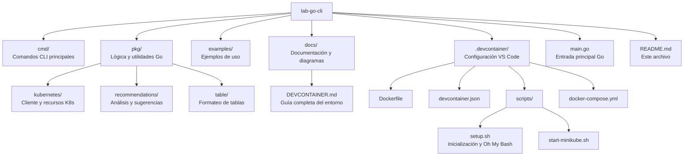
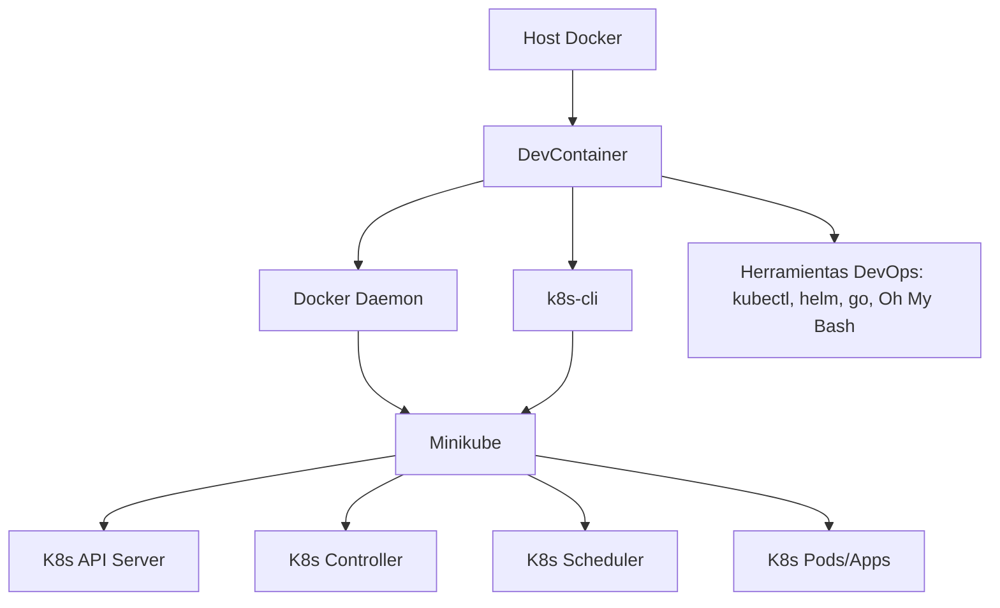

# Lab Go CLI - Kubernetes Development Environment

🚀 **DevContainer + k8s-cli: Entorno Kubernetes Moderno**

> Para la documentación completa, diagramas y detalles técnicos, consulta [`docs/DEVCONTAINER.md`](docs/DEVCONTAINER.md)

---

## 🌟 Protagonistas del Entorno

- **DevContainer**: Proporciona un entorno de desarrollo reproducible, aislado y listo para trabajar con Kubernetes y Go.
- **k8s-cli**: Herramienta CLI avanzada para analizar, monitorear y recomendar mejoras en tu clúster Minikube.


## 📦 Estructura del Proyecto




## 🖼️ Diagrama Completo de Arquitectura




## 🚀 Inicio Rápido

1. **Abre el proyecto en VS Code** y selecciona "Reopen in Container".
2. El entorno se construye automáticamente, incluyendo Oh My Bash para una terminal mejorada.
3. Inicia Minikube:
  ```bash
  .devcontainer/scripts/start-minikube.sh
  ```
4. Compila y prueba el CLI:
  ```bash
  go build -o k8s-cli .
  ./k8s-cli all
  ```


## 🐚 Experiencia Mejorada en Terminal

El entorno instala automáticamente **Oh My Bash** para una terminal más amigable y productiva.

---

## 🧑‍💻 Ejemplos de Comandos de la CLI

```bash
# Obtener información completa del clúster
k8s-cli all

# Ver versión y componentes detectados
k8s-cli version

# Monitorear recursos
k8s-cli resources

# Obtener recomendaciones de optimización
k8s-cli recommend --severity Medium

# Ayuda general
k8s-cli --help
```

## ⚙️ Creación de la CLI y sus Comandos

La CLI `k8s-cli` está desarrollada en Go y estructurada en el directorio `cmd/`. Cada comando principal (como `all`, `version`, `resources`, `recommend`) se implementa como un subcomando en archivos separados dentro de `cmd/` y utiliza la lógica de negocio ubicada en `pkg/`.

**Estructura básica de un comando:**

```go
// cmd/version.go
package cmd

import (
  "fmt"
  "github.com/spf13/cobra"
  "lab-go-cli/pkg/kubernetes"
)

var versionCmd = &cobra.Command{
  Use:   "version",
  Short: "Muestra la versión del clúster y componentes detectados",
  Run: func(cmd *cobra.Command, args []string) {
    info := kubernetes.GetClusterVersion()
    fmt.Println(info)
  },
}

func init() {
  rootCmd.AddCommand(versionCmd)
}
```

**Agregar un nuevo comando:**
1. Crea un archivo en `cmd/` (ej. `mycommand.go`).
2. Define el comando usando `cobra.Command`.
3. Añade la lógica en la función `Run`.
4. Regístralo en el `init()` correspondiente.

La CLI se compila y ejecuta con Go:
```bash
go build -o k8s-cli .
./k8s-cli <comando>
```

## 🧪 Pruebas Unitarias y End-to-End

**Pruebas Unitarias:**
Los paquetes en `pkg/` incluyen pruebas unitarias usando el framework estándar de Go (`testing`).

Ejemplo de prueba unitaria:
```go
// pkg/kubernetes/client_test.go
package kubernetes

import "testing"

func TestGetClusterVersion(t *testing.T) {
  got := GetClusterVersion()
  if got == "" {
    t.Error("La versión del clúster no debe estar vacía")
  }
}
```
Para ejecutar todas las pruebas unitarias:
```bash
go test ./pkg/...
```

**Pruebas End-to-End (E2E):**
Puedes crear pruebas E2E en el directorio `examples/` o en un nuevo directorio `test/e2e/` usando scripts Bash o Go para simular flujos completos:

Ejemplo de script E2E:
```bash
# examples/sample_usage.sh
minikube start
go build -o k8s-cli .
./k8s-cli all
kubectl get nodes
```

Para pruebas E2E más avanzadas, puedes usar Go con librerías como `os/exec` para automatizar la ejecución de comandos y validaciones.

---

¿Dudas, sugerencias o problemas? Consulta la documentación o abre un issue.

## 📚 Documentación Completa

Toda la información detallada, guías de uso, solución de problemas y personalización está en [`docs/DEVCONTAINER.md`](docs/DEVCONTAINER.md).

---

¿Dudas, sugerencias o problemas? Consulta la documentación o abre un issue.