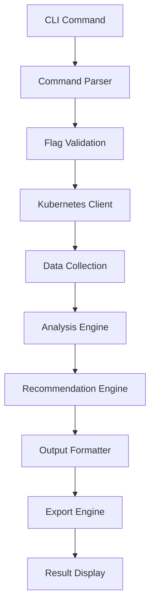

# 🏗️ k8s-cli Architecture Documentation

## 📋 Overview

k8s-cli has evolved from a basic information tool to a comprehensive enterprise platform for Kubernetes cluster analysis, optimization, and monitoring. The architecture is designed for scalability, maintainability, and extensibility.

## 🎯 Design Principles

### 🔧 **Modular Architecture**
- **Separation of concerns** - Clear boundaries between CLI, business logic, and data layers
- **Pluggable components** - Easy to extend with new analysis engines
- **Testable design** - Each component can be tested independently

### 🚀 **Performance First**
- **Concurrent operations** - Parallel data fetching and analysis
- **Efficient memory usage** - Optimized for large clusters
- **Caching strategies** - Smart caching to reduce API calls

### 🛡️ **Enterprise Ready**
- **Security focused** - No credential logging, secure API access
- **Multi-format exports** - JSON, CSV, Prometheus integration
- **Comprehensive error handling** - Graceful degradation and recovery

## 🗂️ Project Structure

```
k8s-cli/
├── cmd/                    # CLI Commands (Cobra framework)
│   ├── all.go             # Complete cluster analysis
│   ├── cost.go            # Cost analysis and optimization
│   ├── export.go          # Multi-format data export
│   ├── logs.go            # Events and log analysis
│   ├── metrics.go         # Real-time metrics and utilization
│   ├── recommend.go       # Optimization recommendations
│   ├── resources.go       # Basic resource overview
│   ├── root.go            # Root command and global flags
│   ├── version.go         # Version information
│   └── workload.go        # Workload health analysis
│
├── pkg/                   # Business Logic Layer
│   ├── kubernetes/        # Kubernetes integration
│   │   ├── client.go              # Kubernetes client wrapper
│   │   ├── cost_analysis.go       # Cost calculation engine
│   │   ├── events_logs.go         # Event and log processing
│   │   ├── metrics.go             # Real-time metrics collection
│   │   ├── simple_resources.go    # Basic resource querying
│   │   ├── utils.go               # Kubernetes utilities
│   │   ├── version.go             # Cluster version detection
│   │   └── workload_health.go     # Workload health scoring
│   │
│   ├── export/            # Data export engine
│   │   ├── exporter.go            # Multi-format export coordinator
│   │   ├── csv.go                 # CSV export implementation
│   │   ├── json.go                # JSON export implementation
│   │   └── prometheus.go          # Prometheus metrics export
│   │
│   ├── recommendations/   # Recommendation engine
│   │   ├── analyzer.go            # Analysis coordinator
│   │   ├── cost_optimizer.go      # Cost optimization recommendations
│   │   ├── performance.go         # Performance recommendations
│   │   └── security.go            # Security recommendations
│   │
│   └── table/             # Output formatting
│       ├── simple_table.go        # Basic table formatting
│       └── table.go               # Table interface definition
│
├── scripts/               # Development and deployment scripts
│   ├── dev-setup.sh              # Development environment setup
│   ├── release.sh                # Automated release script
│   └── pre-release-checks.sh     # Quality assurance checks
│
├── .github/               # GitHub Actions CI/CD
│   └── workflows/
│       ├── ci.yml                # Continuous integration
│       ├── pull-request.yml      # PR quality checks
│       └── release.yml           # Automated releases
│
└── docs/                  # Documentation
    ├── user/              # User-facing documentation
    ├── developer/         # Development documentation
    ├── ops/               # Operations documentation
    └── reference/         # Reference documentation
```

## 🔄 Architecture Flow

### 📊 **Command Execution Flow**



### 🎯 **Data Processing Pipeline**

1. **Input Validation**
   - Command line argument parsing
   - Kubeconfig validation
   - Parameter sanitization

2. **Kubernetes Connection**
   - Client initialization
   - Authentication handling
   - API server connectivity

3. **Data Collection**
   - Parallel resource fetching
   - Metrics collection
   - Event aggregation

4. **Analysis Processing**
   - Cost calculation
   - Performance analysis
   - Health scoring

5. **Recommendation Generation**
   - Pattern recognition
   - Optimization identification
   - Priority scoring

6. **Output Generation**
   - Format selection
   - Data serialization
   - Export execution

## 🧩 Core Components

### 🎯 **CLI Layer (cmd/)**

#### **Command Structure**
```go
// Root command with global configuration
type RootCmd struct {
    kubeconfig string
    namespace  string
    output     string
}

// Individual commands implement cobra.Command
type Command interface {
    Execute() error
    Validate() error
    GetHelp() string
}
```

#### **Key Commands**
- **`all`** - Comprehensive cluster analysis
- **`metrics`** - Real-time performance monitoring
- **`cost`** - Financial analysis and optimization
- **`workload`** - Application health assessment
- **`export`** - Multi-format data export

### 🔧 **Business Logic Layer (pkg/)**

#### **Kubernetes Integration (pkg/kubernetes/)**
```go
// Primary interface for Kubernetes operations
type Client interface {
    GetClusterInfo() (*ClusterInfo, error)
    GetResourceUtilization() ([]ResourceMetric, error)
    GetCostAnalysis() (*CostAnalysis, error)
    GetWorkloadHealth() ([]WorkloadHealth, error)
}

// Implementation with caching and optimization
type KubernetesClient struct {
    clientset    kubernetes.Interface
    metricsClient metrics.Interface
    config       *rest.Config
    cache        *ClientCache
}
```

#### **Analysis Engines**
- **Cost Engine** - Resource pricing and optimization
- **Metrics Engine** - Real-time performance data
- **Health Engine** - Workload health scoring
- **Recommendation Engine** - Automated optimization suggestions

#### **Export System (pkg/export/)**
```go
// Multi-format export interface
type Exporter interface {
    ExportToJSON(data interface{}, filename string) error
    ExportToCSV(data interface{}, filename string) error
    ExportToPrometheus(data interface{}, filename string) error
}
```

### 📊 **Data Models**

#### **Core Data Structures**
```go
// Cluster-wide information
type ClusterInfo struct {
    Version        string
    NodeCount      int
    PodCount       int
    NamespaceCount int
    Components     []Component
}

// Resource utilization metrics
type ResourceMetric struct {
    Name           string
    Namespace      string
    CPUUsage       float64
    MemoryUsage    float64
    Utilization    float64
    Recommendations []string
}

// Cost analysis data
type CostAnalysis struct {
    TotalCost      float64
    NodeCosts      []NodeCost
    Optimizations  []CostOptimization
    Savings        float64
}

// Workload health assessment
type WorkloadHealth struct {
    Name           string
    Type           string
    HealthScore    float64
    Issues         []HealthIssue
    Recommendations []string
}
```

## 🔒 Security Architecture

### 🛡️ **Security Principles**

#### **Credential Management**
- **No credential storage** - Uses existing kubeconfig
- **No logging of secrets** - Sanitized error messages
- **Minimal permissions** - Read-only cluster access

#### **Data Protection**
- **No persistent storage** - Data processed in memory
- **Secure exports** - Configurable data retention
- **Audit logging** - Optional activity tracking

#### **Network Security**
- **TLS enforcement** - Secure API communication
- **Certificate validation** - Proper cert chain verification
- **Timeout handling** - Prevents hanging connections

### 🔐 **Authentication & Authorization**

```go
// Secure client configuration
type SecureConfig struct {
    TLSConfig     *tls.Config
    BearerToken   string
    CertFile      string
    KeyFile       string
    CAFile        string
}

// RBAC requirements (minimum permissions)
const RequiredPermissions = `
resources: ["nodes", "pods", "services", "deployments"]
verbs: ["get", "list"]
`
```

## 🚀 Performance Architecture

### ⚡ **Optimization Strategies**

#### **Concurrent Processing**
```go
// Parallel data collection
func (c *Client) CollectAllData(ctx context.Context) (*AnalysisData, error) {
    var wg sync.WaitGroup
    
    // Collect different data types in parallel
    go c.collectNodes(ctx, &wg, results)
    go c.collectPods(ctx, &wg, results)
    go c.collectMetrics(ctx, &wg, results)
    
    wg.Wait()
    return aggregateResults(results), nil
}
```

#### **Efficient Memory Usage**
- **Streaming processing** - Process data as it arrives
- **Garbage collection optimization** - Minimal object allocation
- **Resource pooling** - Reuse expensive objects

#### **Smart Caching**
- **API response caching** - Reduce redundant calls
- **Computed result caching** - Cache expensive calculations
- **Time-based invalidation** - Fresh data when needed

### 📊 **Scalability Design**

#### **Large Cluster Support**
- **Pagination handling** - Efficient large dataset processing
- **Resource limiting** - Configurable memory and CPU limits
- **Timeout management** - Graceful handling of slow clusters

#### **Multi-Cluster Ready**
- **Context switching** - Easy cluster switching
- **Parallel analysis** - Multiple clusters simultaneously
- **Aggregated reporting** - Cross-cluster insights

## 🔄 Extension Points

### 🔌 **Plugin Architecture**

#### **Analyzer Plugins**
```go
// Interface for custom analyzers
type Analyzer interface {
    Name() string
    Analyze(cluster *ClusterData) (*AnalysisResult, error)
    GetRecommendations(result *AnalysisResult) []Recommendation
}

// Plugin registration
func RegisterAnalyzer(analyzer Analyzer) {
    analyzerRegistry[analyzer.Name()] = analyzer
}
```

#### **Export Plugins**
```go
// Interface for custom exporters
type ExportPlugin interface {
    Name() string
    SupportedFormats() []string
    Export(data interface{}, format string, options ExportOptions) error
}
```

### 📈 **Metrics Integration**

#### **Prometheus Integration**
- **Custom metrics** - k8s-cli specific metrics
- **Standard metrics** - Kubernetes standard metrics
- **Alerting rules** - Automated problem detection

#### **Observability**
- **Structured logging** - Machine-readable logs
- **Tracing support** - Request tracing capabilities
- **Health endpoints** - Self-monitoring capabilities

## 🧪 Testing Architecture

### 🎯 **Testing Strategy**

#### **Unit Testing**
- **Component isolation** - Mock all external dependencies
- **High coverage** - >80% code coverage target
- **Fast execution** - <30 seconds full test suite

#### **Integration Testing**
- **Real cluster testing** - Kind/minikube integration
- **API contract testing** - Kubernetes API compatibility
- **Cross-platform testing** - Linux, macOS, Windows

#### **End-to-End Testing**
- **CLI testing** - Complete command validation
- **Export validation** - Output format verification
- **Performance testing** - Large cluster simulation

```go
// Test structure example
func TestCostAnalysis(t *testing.T) {
    // Setup mock cluster
    cluster := setupMockCluster()
    
    // Execute analysis
    result, err := analyzer.AnalyzeCost(cluster)
    
    // Validate results
    assert.NoError(t, err)
    assert.NotNil(t, result)
    assert.Greater(t, result.TotalCost, 0.0)
}
```

## 📈 Future Architecture Considerations

### 🌐 **Planned Enhancements**

#### **Multi-Cluster Support**
- **Federation analysis** - Cross-cluster insights
- **Cluster comparison** - Comparative analysis
- **Global optimization** - Multi-cluster recommendations

#### **Machine Learning Integration**
- **Predictive analytics** - Future resource needs
- **Anomaly detection** - Unusual pattern identification
- **Intelligent recommendations** - ML-driven optimization

#### **Web Interface**
- **Dashboard creation** - Visual cluster analysis
- **API service** - REST API for external integration
- **Real-time updates** - Live cluster monitoring

### 🔮 **Scalability Roadmap**

#### **Enterprise Features**
- **RBAC integration** - Fine-grained access control
- **Audit logging** - Compliance and tracking
- **Multi-tenancy** - Isolated analysis per team

#### **Cloud Integration**
- **Cloud cost integration** - Real cloud provider costs
- **Resource optimization** - Cloud-specific recommendations
- **Automated scaling** - Dynamic resource adjustment

## 📚 Architecture Documentation Standards

### 📖 **Documentation Requirements**

#### **Component Documentation**
- **Interface documentation** - All public interfaces documented
- **Design decisions** - Architecture decision records (ADRs)
- **Performance characteristics** - Expected performance profiles

#### **Code Documentation**
- **GoDoc comments** - All exported functions documented
- **Example usage** - Practical examples for complex functions
- **Error handling** - Documented error conditions

#### **Architecture Updates**
- **Change documentation** - Document architectural changes
- **Migration guides** - Help for breaking changes
- **Performance impact** - Document performance implications

---

## 🎯 Summary

The k8s-cli architecture is designed for:

- **🚀 Performance** - Efficient, concurrent operations
- **🔒 Security** - Enterprise-grade security practices
- **🔧 Maintainability** - Clear separation of concerns
- **📈 Scalability** - Support for large clusters and teams
- **🔌 Extensibility** - Plugin architecture for customization

This architecture enables k8s-cli to serve as a comprehensive platform for Kubernetes analysis, from small development clusters to large enterprise deployments.

---

**Last Updated:** 2025-08-14  
**Version:** 2.0.6  
**Architecture Version:** 2.1