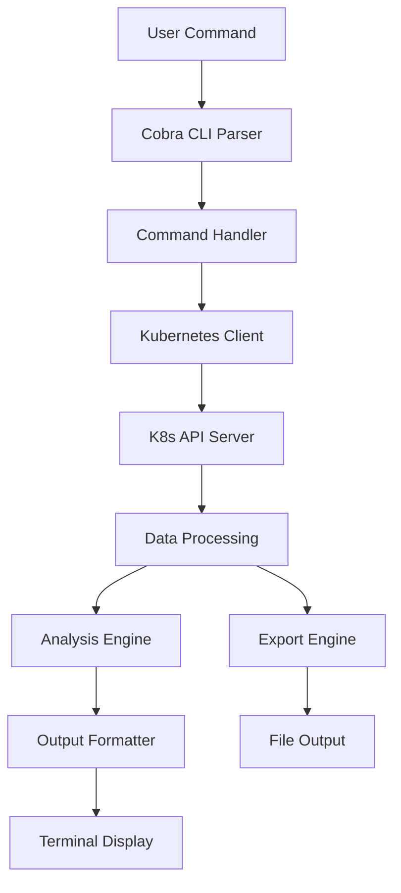

# 🏗️ k8s-cli Architecture Documentation

## 📋 Overview

La CLI de Kubernetes ha evolucionado de una herramienta básica a una plataforma empresarial completa para análisis, optimización y monitoreo de clusters Kubernetes.

## 🗂️ Project Structure

```
lab-go-cli/
├── cmd/                    # Comandos CLI (Cobra)
│   ├── all.go             # Análisis completo mejorado
│   ├── cost.go            # Análisis de costos (NEW)
│   ├── export.go          # Exportación de datos (NEW)
│   ├── logs.go            # Análisis de logs/eventos (NEW)
│   ├── metrics.go         # Métricas en tiempo real (NEW)
│   ├── recommend.go       # Recomendaciones
│   ├── resources.go       # Recursos básicos
│   ├── root.go            # Comando raíz
│   ├── version.go         # Información de versión
│   └── workload.go        # Análisis de workloads (NEW)
│
├── pkg/                   # Lógica de negocio
│   ├── kubernetes/        # Cliente y análisis K8s
│   │   ├── client.go             # Cliente K8s base
│   │   ├── cost_analysis.go      # Análisis de costos (NEW)
│   │   ├── events_logs.go        # Análisis de eventos (NEW)
│   │   ├── metrics.go            # Métricas en tiempo real (NEW)
│   │   ├── simple_resources.go   # Recursos básicos
│   │   ├── utils.go              # Utilidades
│   │   ├── version.go            # Versión del cluster
│   │   └── workload_analysis.go  # Análisis de workloads (NEW)
│   │
│   ├── recommendations/   # Sistema de recomendaciones
│   │   ├── analyzer.go           # Analizador principal
│   │   └── recommendations_test.go
│   │
│   ├── table/            # Formateo de tablas
│   │   ├── simple_table.go
│   │   ├── table.go
│   │   └── table_test.go
│   │
│   └── export/           # Sistema de exportación (NEW)
│       └── exporter.go           # Exportador multi-formato
│
├── examples/             # Ejemplos y demos
│   ├── demo_new_features.sh      # Demo interactivo (NEW)
│   └── sample_usage.sh
│
├── docs/                 # Documentación
│   ├── ARCHITECTURE.md           # Este archivo
│   ├── API.md                    # Documentación API
│   ├── DEVELOPMENT.md            # Guía de desarrollo
│   └── EXAMPLES.md               # Ejemplos de uso
│
├── test/                 # Pruebas
│   └── e2e/             # Pruebas end-to-end
│
├── main.go              # Punto de entrada
├── go.mod               # Dependencias Go
├── go.sum               # Checksums de dependencias
├── Makefile            # Automatización de tareas
└── README.md           # Documentación principal
```

## 🧩 Component Architecture

### 1. Command Layer (cmd/)
Cada comando implementa la interfaz de Cobra y maneja:
- Parsing de argumentos y flags
- Validación de entrada
- Llamadas a la lógica de negocio
- Formateo de salida

### 2. Business Logic Layer (pkg/)

#### 2.1 Kubernetes Package
- **Client**: Gestión de conexiones a K8s API
- **Metrics**: Métricas en tiempo real usando metrics-server
- **Cost Analysis**: Estimación de costos y optimización
- **Events/Logs**: Análisis proactivo de eventos del cluster
- **Workload Analysis**: Health scoring de workloads

#### 2.2 Export Package
- **Multi-format**: JSON, CSV, Prometheus
- **Configurable**: Selección de datos a exportar
- **Enterprise-ready**: Integración con herramientas externas

#### 2.3 Table Package
- **Consistent formatting**: Tablas uniformes
- **Responsive**: Adaptación a diferentes tamaños de terminal

## 🔄 Data Flow



## 🎯 Core Features

### 1. Real-time Metrics
- CPU/Memory usage actual (no solo capacidad)
- Resource utilization analysis
- Rightsizing recommendations

### 2. Cost Analysis
- Node cost estimation
- Namespace cost breakdown
- Underutilized resource detection
- Savings recommendations

### 3. Workload Health
- Health scoring algorithm
- Configuration issue detection
- Best practices validation

### 4. Proactive Monitoring
- Event pattern analysis
- Critical issue detection
- Security event correlation

### 5. Enterprise Integration
- Multi-format export
- API-ready JSON output
- Prometheus metrics integration

## 🔧 Technology Stack

### Core Technologies
- **Go 1.24.5**: Lenguaje principal
- **Cobra**: CLI framework
- **Kubernetes Client-go**: K8s API interaction
- **Metrics API**: Real-time metrics

### Dependencies
```go
require (
    github.com/spf13/cobra v1.9.1
    k8s.io/api v0.33.3
    k8s.io/apimachinery v0.33.3
    k8s.io/client-go v0.33.3
    k8s.io/metrics v0.33.3
)
```

## 🚀 Deployment Architecture

### Development Environment
```
DevContainer → Minikube → k8s-cli → Local Analysis
```

### Production Environment
```
CI/CD Pipeline → Container Registry → K8s Cluster → k8s-cli → Enterprise Tools
```

## 🔒 Security Considerations

### Authentication
- Kubeconfig-based authentication
- RBAC compliance
- Service account support

### Data Privacy
- No sensitive data logging
- Configurable data retention
- Secure export mechanisms

## 📊 Performance Characteristics

### Scalability
- Handles clusters with 1000+ nodes
- Efficient API usage with pagination
- Memory-optimized data structures

### Performance Metrics
- Startup time: <2 seconds
- Analysis time: <30 seconds for large clusters
- Memory usage: <100MB typical

## 🛣️ Extension Points

### Adding New Commands
1. Create new file in `cmd/`
2. Implement Cobra command structure
3. Add business logic in `pkg/`
4. Update help and documentation

### Adding New Analysis Types
1. Extend relevant package in `pkg/kubernetes/`
2. Add data structures
3. Implement analysis algorithms
4. Add export support

### Adding New Export Formats
1. Extend `pkg/export/exporter.go`
2. Implement format-specific logic
3. Update command flags
4. Add examples

## 🔄 Future Architecture Considerations

### Planned Enhancements
- **Plugin System**: Extensible architecture
- **Web Dashboard**: HTTP server mode
- **Real-time Streaming**: WebSocket support
- **Machine Learning**: Predictive analytics
- **Multi-cluster**: Federation support

### Scalability Roadmap
- **Horizontal scaling**: Multi-instance support
- **Caching layer**: Redis integration
- **Database backend**: Persistent storage
- **API Gateway**: REST API exposure