# 📊 k8s-cli Command Structure & Flow Diagrams

## 🎯 Complete Command Overview

```mermaid
graph TB
    subgraph "k8s-cli Command Hierarchy"
        CLI[k8s-cli]
        
        subgraph "Core Analysis Commands"
            ALL[all<br/>📊 Complete Analysis]
            VERSION[version<br/>ℹ️ Cluster Info]
            RESOURCES[resources<br/>📦 Basic Resources]
            RECOMMEND[recommend<br/>💡 Suggestions]
        end
        
        subgraph "Advanced Analytics"
            METRICS[metrics<br/>📈 Real-time Metrics]
            COST[cost<br/>💰 Cost Analysis]
            WORKLOAD[workload<br/>🔍 Health Scoring]
            LOGS[logs<br/>📋 Event Analysis]
        end
        
        subgraph "Enterprise Integration"
            EXPORT[export<br/>📤 Data Export]
        end
        
        subgraph "Data Flow"
            K8S_API[(Kubernetes API)]
            METRICS_SERVER[(Metrics Server)]
            EVENT_STORE[(Event Store)]
        end
        
        subgraph "Output Formats"
            CONSOLE[🖥️ Terminal]
            JSON[📄 JSON Files]
            CSV[📊 CSV Reports]
            PROMETHEUS[📈 Prometheus]
        end
    end
    
    CLI --> ALL
    CLI --> VERSION
    CLI --> RESOURCES
    CLI --> RECOMMEND
    CLI --> METRICS
    CLI --> COST
    CLI --> WORKLOAD
    CLI --> LOGS
    CLI --> EXPORT
    
    ALL --> K8S_API
    ALL --> METRICS_SERVER
    ALL --> EVENT_STORE
    
    METRICS --> METRICS_SERVER
    COST --> K8S_API
    WORKLOAD --> K8S_API
    LOGS --> EVENT_STORE
    VERSION --> K8S_API
    RESOURCES --> K8S_API
    RECOMMEND --> K8S_API
    
    ALL --> CONSOLE
    METRICS --> CONSOLE
    COST --> CONSOLE
    WORKLOAD --> CONSOLE
    LOGS --> CONSOLE
    
    EXPORT --> JSON
    EXPORT --> CSV
    EXPORT --> PROMETHEUS
    
    classDef coreCmd fill:#e3f2fd,stroke:#1976d2,stroke-width:3px
    classDef advancedCmd fill:#f3e5f5,stroke:#7b1fa2,stroke-width:3px
    classDef enterpriseCmd fill:#e8f5e8,stroke:#388e3c,stroke-width:3px
    classDef dataSource fill:#fff3e0,stroke:#f57c00,stroke-width:2px
    classDef output fill:#fce4ec,stroke:#c2185b,stroke-width:2px
    
    class ALL,VERSION,RESOURCES,RECOMMEND coreCmd
    class METRICS,COST,WORKLOAD,LOGS advancedCmd
    class EXPORT enterpriseCmd
    class K8S_API,METRICS_SERVER,EVENT_STORE dataSource
    class CONSOLE,JSON,CSV,PROMETHEUS output
```



## 🔄 Command Execution Flow


## 🎯 Command Feature Matrix

```mermaid
gitgraph
    commit id: "v1.0 - Basic CLI"
    branch core-commands
    checkout core-commands
    commit id: "all - Basic analysis"
    commit id: "version - Cluster info"
    commit id: "resources - Resource list"
    commit id: "recommend - Basic tips"
    
    checkout main
    merge core-commands
    commit id: "v1.5 - Enhanced Core"
    
    branch advanced-analytics
    checkout advanced-analytics
    commit id: "metrics - Real-time data"
    commit id: "cost - Cost analysis"
    commit id: "workload - Health scoring"
    commit id: "logs - Event analysis"
    
    checkout main
    merge advanced-analytics
    commit id: "v2.0 - Enterprise Platform"
    
    branch enterprise-features
    checkout enterprise-features
    commit id: "export - Multi-format"
    commit id: "integration - APIs"
    commit id: "automation - CI/CD"
    
    checkout main
    merge enterprise-features
    commit id: "v2.0 - Production Ready"
```

## 📊 Command Complexity & User Journey


## 🔧 Command Flag Hierarchy


## 🎯 Use Case Mapping


## 📈 Command Performance Profile


## 🔄 Integration Patterns


---

This diagram suite provides a comprehensive visual understanding of the k8s-cli command structure, execution flows, and integration patterns, making it easier for users to understand how to leverage the platform's capabilities.